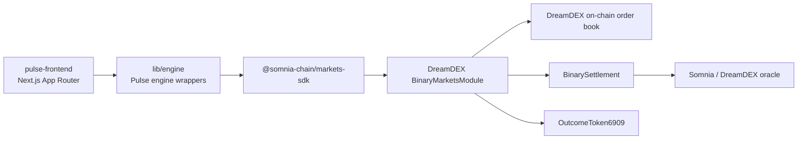
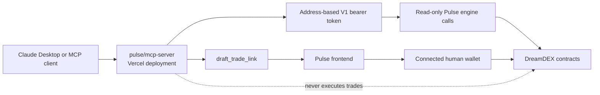

# Pulse

A consumer trading terminal for DreamDEX Event Contracts on Somnia Shannon testnet.

**Live demo:** The deployed Pulse frontend URL is not recoverable from the repository history available here.  
**Live MCP server:** [https://onyxpulsemcp-lyart.vercel.app](https://onyxpulsemcp-lyart.vercel.app)  
**Network:** Somnia Shannon testnet, chain ID `50312`

## What Pulse Actually Is

Pulse is a consumer trading terminal for BTC and ETH binary Event Contracts on DreamDEX. Markets expose Up/Down outcomes over rolling 15-minute and 1-hour windows. Trading uses DreamDEX's real on-chain central limit order book and complete-set minting mechanics; Pulse does not provide its own matching engine or pool-priced swap venue. Settlement is performed by DreamDEX's on-chain oracle and settlement contracts. Every active trade is signed by the connected wallet and submitted as a real owner-authorized transaction. Gasless trading was attempted with Thirdweb smart-wallet sponsorship, verified against real DreamDEX calls, and then rolled back from the production path after repeated Vercel, Turbopack, and module-resolution build failures. The current application uses direct wallet signing through wagmi and viem.

## Quick Reference

| Item | Verified value |
|---|---|
| Network | Somnia Shannon testnet |
| Chain ID | `50312` |
| Block explorer | [https://shannon-explorer.somnia.network](https://shannon-explorer.somnia.network) |
| Explorer transaction URL | `https://shannon-explorer.somnia.network/tx/<transaction-hash>` |
| Test USDC | `0x70a86D8842FB63C4Ad2b7cdddF530eBf1BB25d8E` |
| Engine tests | `315` passing, `0` failing in the latest `pulse` package run |
| Engine test command | `cd pulse && npm test` |
| Full lifecycle demo | `cd pulse && npm run demo` |
| Session/operator demo | `cd pulse && npm run demo:session` |
| MCP server | [https://onyxpulsemcp-lyart.vercel.app](https://onyxpulsemcp-lyart.vercel.app) |
| MCP endpoint | [https://onyxpulsemcp-lyart.vercel.app/mcp](https://onyxpulsemcp-lyart.vercel.app/mcp) |
| MCP connection page | [https://onyxpulsemcp-lyart.vercel.app/connect](https://onyxpulsemcp-lyart.vercel.app/connect) |

The current frontend Vitest invocation reports `125` passing tests, but it also attempts to load Playwright end-to-end files as Vitest suites. Those nine suites fail during collection because Playwright tests are being run by the wrong runner; this is separate from the engine's `315` passing-test result.

## The Core Story

### 1. Trustless settlement

DreamDEX's real on-chain oracle determines market outcomes. Pulse does not use an administrator decision or an application-owned settlement database. The receipt flow exposes the settlement transaction when available and includes the oracle reference when DreamDEX provides one.

The repository does not contain a separately retrievable settled-market transaction hash, so no settlement hash is claimed here. The live trade evidence below confirms the order and fill path; the receipt page is the place to inspect settlement evidence for a resolved market.

### 2. Independently verifiable receipts

Every market has a public receipt route:

```text
/receipt/[marketId]
```

The receipt route does not require a wallet connection. It can display:

- Market question and outcome
- Resolution data
- Settlement transaction link when available
- Oracle explorer link when available
- Testnet and network information
- A downloadable personal receipt with QR code

Receipt data is generated from DreamDEX market and settlement information rather than from a private Pulse database.

### 3. Real order book and complete-set mechanics

Pulse trades against DreamDEX's live on-chain order book. The order book is the venue and the counterparty is another order, not a Pulse-operated pricing curve.

Complete-set minting is the liquidity mechanism available to a participant who wants to create matching YES and NO outcome tokens from collateral. Pulse wraps DreamDEX's mint and burn functions and gates writes against the market's current on-chain status.

### 4. On-chain status gating

DreamDEX indexer data can lag behind contract state. During live testing, the indexer reported a market as resolved while the contract was still settling, and indexed balances temporarily remained behind confirmed on-chain fills.

Pulse therefore reads fresh contract state before writes:

- Market writes require a live on-chain trading status.
- Redemption checks the on-chain market status.
- Outcome balances can be read directly through the SDK's on-chain balance path.
- Market identity is keyed by `marketId`, not by `poolAddress` alone.

This prevents stale indexer state from becoming a misleading confirmation or a failed transaction.

### 5. Somnia-native speed and push-based reactivity

Pulse uses DreamDEX and Somnia's WebSocket-backed SDK subscriptions instead of making the UI depend on short polling loops.

The engine exposes and uses:

- `watchOrderBook`
- `watchMarket`
- `watchPrice`
- `subscribeLive`
- The event-driven `reactiveEngine.ts`

The reactive engine observes real fills and market-status transitions. It never places orders or redeems positions by itself. A longer status read exists only as a safety fallback if a WebSocket connection becomes unhealthy.

### 6. AI-agent read and draft interface

Pulse has a deployed MCP server at [https://onyxpulsemcp-lyart.vercel.app](https://onyxpulsemcp-lyart.vercel.app).

Its tools are read-only or draft-only:

- List live markets
- Read market details
- Read order books
- Read BTC and ETH spot prices
- Read the connected address's portfolio
- Read open and claimable positions
- Generate a pre-filled trade link

The MCP server never holds a private key, never receives delegated trading authority, and never submits a trade. A draft link returns to the Pulse application, where the human reviews the ticket and confirms it with their own wallet.

## Architecture

### Main application path



The frontend uses wagmi and viem for the connected wallet. The engine wraps `@somnia-chain/markets-sdk` and provides market discovery, order-book reads, order placement, complete-set operations, portfolio reads, settlement, receipts, risk checks, and reactive subscriptions.

### MCP read and draft path



The MCP server is a separate service. It reads public market and portfolio data using the address bound to the caller's token. A draft trade becomes a URL back into the main Pulse application. Only the user-controlled frontend wallet can review and submit that transaction.

## Verifiable Proof: Real Testnet Transactions

The following table includes only transaction evidence currently retrievable from the project record.

| Stage | Tx / Evidence | What to check |
|---|---|---|
| Order placement and live fill | [`0x59f2a1397aee7c89810c99a5e90f9401ac4c8c652d1685ca250093f6125bd3ab`](https://shannon-explorer.somnia.network/tx/0x59f2a1397aee7c89810c99a5e90f9401ac4c8c652d1685ca250093f6125bd3ab) | Status is Success. The transaction is the confirmed Buy Yes trade from the Pulse UI. Inspect the receipt and token transfers for a real fill against DreamDEX's live order book and a real counterparty. |
| Test USDC contract | [`0x70a86D8842FB63C4Ad2b7cdddF530eBf1BB25d8E`](https://shannon-explorer.somnia.network/address/0x70a86D8842FB63C4Ad2b7cdddF530eBf1BB25d8E) | Confirm the 6-decimal test collateral contract used by Pulse on Shannon. |
| Full lifecycle script | `cd pulse && npm run demo` | Runs faucet funding, live market discovery, complete-set minting, order-book inspection, order placement, natural oracle resolution, redemption, and receipt construction. It waits for the real market window instead of force-resolving. |
| Session/operator script | `cd pulse && npm run demo:session` | Demonstrates owner and operator client setup, permission reads, grant and revoke calls, and the documented operator flow. It does not claim that operator execution works for binary Event Contract pools. |

The project history does not contain additional retrievable faucet, mint, or redemption hashes. Those events are not represented here with fabricated values.

### Demo lifecycle

```bash
cd pulse
DEMO_PRIVATE_KEY=0x... npm run demo
```

The lifecycle script:

1. Creates a Shannon client and trader.
2. Requests test USDC through DreamDEX's faucet.
3. Finds a live BTC or ETH binary market.
4. Mints a complete YES and NO set.
5. Reads the order book.
6. Places a limit order.
7. Waits for the real oracle window to resolve.
8. Redeems the resulting position.
9. Builds receipt data with explorer references.

The complete run takes several minutes because it waits for genuine market expiry and oracle settlement.

### Session demonstration

```bash
cd pulse
OWNER_KEY=0x... OPERATOR_KEY=0x... npm run demo:session
```

`OPERATOR_KEY` is optional and defaults to `OWNER_KEY` for single-wallet demonstration mode. The script documents the permission and delegation path, but it does not misrepresent that path as a working Event Contract execution route.

## Being Straight About What Is Real

### Natural resolution instead of force resolution

DreamDEX's testnet exposes force-resolution functions that require a FakeOracle address. That address is not included in the SDK's testnet address configuration and is not published in the documentation, bot kit, or Shannon explorer material inspected during the build.

Pulse's lifecycle demo therefore waits for natural market resolution. The documented runtime is approximately 5 to 20 minutes, depending on the selected market window. This is a testnet and hackathon demonstration constraint, not a claim about production settlement.

### Operator and session-key scope

DreamDEX's operator/session-key implementation is source-verified and live-tested for spot markets. Binary Event Contract pools do not expose the same operator gate. A permission grant can succeed while the corresponding binary-pool authorization check reverts.

This is a protocol limitation, not a Pulse implementation bug. Pulse's Event Contract trading path therefore uses direct owner-signed transactions.

### Gasless trading was attempted and rolled back

Pulse previously built a Thirdweb smart-wallet sponsorship path:

```text
Thirdweb smart wallet
    -> sponsored transaction
    -> OperatorSigner adapter
    -> DreamDEX contract call
```

The approach was live-verified against real DreamDEX calls, including sponsored faucet and complete-set operations. It was then fully removed from the active frontend trading path after repeated Vercel, Turbopack, and module-resolution failures prevented a reliable deployment.

This was a pragmatic engineering tradeoff. It does not establish that sponsored trading is impossible on the stack; it establishes that the attempted integration was not stable enough to ship in this project.

### MCP authentication is intentionally V1

The deployed MCP server uses an address-bound bearer token. The token is associated with a public wallet address entered through `/connect`.

This is not a full OAuth 2.1 implementation. It is a disclosed V1 simplification that is acceptable for the current read-only and draft-only tool set because the server cannot execute trades or access private keys. Tokens are held in memory for long-running hosts and use HMAC signing for the Vercel stateless path.

### Bugs found live, fixed, and verified

The build used live testnet behavior to find and correct several concrete issues:

| Issue | Resolution |
|---|---|
| Wrong SDK function used for a trading path | Replaced it with the verified DreamDEX SDK call. |
| `poolAddress` and `marketAddress` treated as interchangeable | Kept market identity keyed by `marketId` and passed the correct address to each SDK operation. |
| Missing per-market lot-size alignment | Read and applied runtime lot-size constraints before order submission. |
| `NO_LIQUIDITY` treated as an opaque failure | Added explicit handling and user-facing feedback. |
| Locked market could remain interactive mid-session | Added proactive locked-market detection and disabled writes when the market is no longer tradable. |
| Portfolio values were calculated from the wrong position data | Corrected open and settled position handling and separated portfolio value calculations. |
| Indexer status and balances lagged confirmed chain state | Added direct on-chain status and balance reads before sensitive writes. |
| Voided markets could redeem only one side | Read both YES and NO balances and redeem each non-zero side explicitly. |

These fixes are part of the reason the engine's current automated test suite covers `315` passing tests.

### Testnet-only status

Pulse is a Somnia Shannon testnet project. It uses test USDC only. No real funds are used or supported by the current deployment.

## Setup and Run

### Clone the repository

```bash
git clone https://github.com/DiverseXL/onyxpulse.git
cd onyxpulse
```

### Install the engine

```bash
cd pulse
npm install
```

The root `pulse` package owns the engine and declares `mcp-server` as an npm workspace. The MCP server still has its own package directory and should be installed there when running it independently.

### Run engine tests and demos

```bash
cd pulse

npm test
npm run demo
npm run demo:session
```

Required demo variables:

```bash
DEMO_PRIVATE_KEY=0x...
```

For the session demonstration:

```bash
OWNER_KEY=0x...
OPERATOR_KEY=0x...
```

`OPERATOR_KEY` is optional and defaults to `OWNER_KEY`.

The demo wallet must have Shannon STT before it can submit the faucet transaction. The faucet provides test USDC collateral; it does not provide gas.

### Install and run the frontend

```bash
cd pulse-frontend
npm install
npm run dev
```

Open [http://localhost:3000](http://localhost:3000).

The active frontend wallet path uses wagmi and viem with an injected wallet. Read-only browsing works without application-specific secrets. The current `.env.example` also contains legacy Thirdweb variables from the rolled-back sponsorship work; they are not required by the active trading flow.

Optional frontend configuration:

```bash
NEXT_PUBLIC_MCP_URL=https://onyxpulsemcp-lyart.vercel.app
NEXT_PUBLIC_APP_URL=http://localhost:3000
```

### Install and run the MCP server

```bash
cd pulse/mcp-server
npm install
npm run serve:vercel
```

For a long-running local host:

```bash
npm run railway-start
```

Required for the deployed Vercel path:

```bash
PULSE_MCP_SIGNING_SECRET=...
PULSE_APP_URL=http://localhost:3000
PULSE_MCP_PUBLIC_URL=http://localhost:4790
```

The MCP server also supports:

```bash
PULSE_MCP_TOKEN_TTL_MS=2592000000
PULSE_MCP_STATELESS=1
PULSE_MCP_SESSION_IDLE_TTL_MS=1800000
PORT=4790
```

`CLAIM_BOT_PRIVATE_KEY` is not required by the current repository. No active claim-bot path is present in the project structure.

MCP checks:

```bash
npm test
npm run typecheck
node scripts/smoke.mjs http://localhost:4790 0xYourPublicAddress
```

## Repository Layout

```text
onyxpulse/
├── package.json
├── pulse/
│   ├── package.json
│   ├── BACKEND.md
│   ├── FEEDBACK.md
│   ├── SECURITY.md
│   ├── scripts/
│   │   ├── demo-lifecycle.ts
│   │   └── demo-session.ts
│   ├── src/
│   │   ├── engine/
│   │   │   ├── candles.ts
│   │   │   ├── claimAll.ts
│   │   │   ├── client.ts
│   │   │   ├── demo.ts
│   │   │   ├── errors.ts
│   │   │   ├── index.ts
│   │   │   ├── ladder.ts
│   │   │   ├── markets.ts
│   │   │   ├── operator.ts
│   │   │   ├── orderbook.ts
│   │   │   ├── portfolio.ts
│   │   │   ├── priceFeed.ts
│   │   │   ├── reactiveEngine.ts
│   │   │   ├── receipt.ts
│   │   │   ├── riskEngine.ts
│   │   │   ├── sets.ts
│   │   │   ├── settlement.ts
│   │   │   ├── statusGate.ts
│   │   │   ├── trading.ts
│   │   │   ├── units.ts
│   │   │   └── __tests__/
│   │   └── wallet/
│   │       ├── thirdwebAdapter.ts
│   │       └── __tests__/
│   └── mcp-server/
│       ├── package.json
│       ├── vercel.json
│       ├── api/
│       ├── scripts/
│       └── src/
│           ├── engine/
│           └── __tests__/
├── pulse-frontend/
│   ├── package.json
│   ├── app/
│   │   ├── page.tsx
│   │   ├── markets/page.tsx
│   │   ├── market/[id]/page.tsx
│   │   ├── portfolio/page.tsx
│   │   ├── receipt/[marketId]/page.tsx
│   │   ├── faucet/page.tsx
│   │   ├── how-to-trade/page.tsx
│   │   ├── connect-agent/page.tsx
│   │   ├── settings/page.tsx
│   │   └── api/
│   ├── components/
│   │   ├── markets/
│   │   └── ...
│   ├── lib/
│   │   ├── engine/
│   │   └── wallet/
│   ├── __tests__/
│   └── e2e/
├── spike-thirdweb-aa/
└── spike-privy-pimlico/
```

The two spike directories contain historical account-abstraction experiments. They are not part of the active Pulse trading path.

## Submission Checklist

The following assessment uses the stated Somnia and DreamDEX hackathon criteria.

| Criterion | Weight | Status | Evidence and honest assessment |
|---|---:|---|---|
| Innovation and Originality | 20% | Built and demonstrated | Pulse combines a consumer Event Contract terminal, verifiable settlement receipts, live order-book interaction, complete-set mechanics, and an MCP read/draft interface. The MCP path is intentionally non-custodial and does not autonomously execute trades. |
| Technical Implementation | 25% | Built and verified | The engine has `315` passing tests. The frontend uses Next.js, wagmi, viem, WebSocket-backed SDK subscriptions, on-chain status gates, direct balance reads, receipts, and DreamDEX contract integration. The production trading path uses direct owner signing rather than the rolled-back sponsored-wallet experiment. |
| User Experience and Design | 20% | Built and live-tested | The frontend includes market discovery, market detail, order-book trading, portfolio, faucet onboarding, settings, locked-market handling, error states, receipt pages, QR receipts, responsive layouts, and an agent connection flow. |
| Business and Ecosystem Impact | 20% | Partially demonstrated | Pulse is built specifically for DreamDEX Event Contracts on Somnia and exposes reusable engine and MCP integration surfaces. It remains testnet-only, uses test USDC, and does not yet claim production custody, OAuth, or mainnet readiness. |
| Presentation and Demo | 15% | Reproducible, with testnet timing constraint | `npm run demo` provides the full real lifecycle and waits for natural oracle resolution. `npm run demo:session` documents the operator path and its binary-market limitation. A complete lifecycle can take several minutes because the testnet FakeOracle address is unavailable. |

## Current Verification Boundary

Pulse is real where the repository and live testnet evidence say it is real:

- Real DreamDEX markets and order books
- Real owner-signed transactions
- Real on-chain fills
- Real test USDC collateral
- Real oracle-driven settlement architecture
- Real WebSocket-backed market reactivity
- Real public receipt routes
- Real deployed MCP read and draft tools
- Real automated engine coverage

Pulse does not claim:

- Production or mainnet readiness
- Gasless trading in the active frontend
- Autonomous agent execution
- Full OAuth 2.1 authorization
- Binary Event Contract execution through operator/session-key delegation
- Instant demo settlement through an accessible FakeOracle
- Use of real funds
